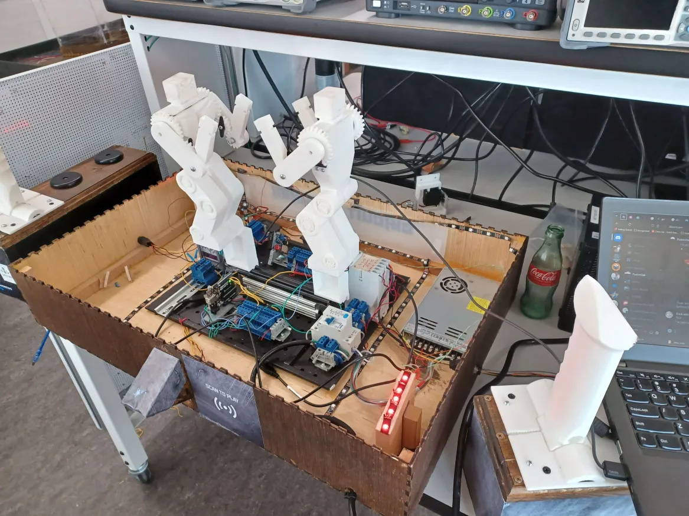

# Design Day 2024 - Rock-em Sock-em

<!--Rock-em-sock-em inspired group project for the 2024 Design Day fair at Utah Tech University.-->

A group project for the official Utah Tech University Engineering Design Day Fair presented at the Carnival Games portion of the event. A Rock-Em Sock-Em inspired game driven by servos, pound pads, and four microcontrollers using I2C protocols. 

This project was a collaboration between three people. \
&emsp; Stephen Harris (me) \
&emsp; Porter Cook \
&emsp; Jonathan

The workload was split between the three members based on specilizations. Porter Cook, the Mechantronics Engineer, managed the wiring, and built the housing. Jonathan, the Mechanical Engineer, the  designed the CAD models for the robots, and printed them out, and Stephen Harris (myself), the Computer Engineer, planned the electronic components and pins, and wrote the code for the project, which is now located in this repository.

More information on the annual *Utah Tech University Discovery and Design Day* event can be found [here](https://mech.utahtech.edu/discovery-design-day/).

## Images

 

[View All Images of the Project](images.md)

## How to Build

<ins>Dependancies</ins> \
[Arduino AVR Core](https://github.com/arduino/ArduinoCore-avr) \
[Adafruit IO Arduino](https://github.com/adafruit/Adafruit_IO_Arduino) \
[WiFiNINA Arduino](https://github.com/arduino-libraries/WiFiNINA) \
[FastLED Arduino](https://github.com/FastLED/FastLED) \
[GyverHX711 Library](https://github.com/GyverLibs/GyverHX711) \
[MFRC522 RFID Library](https://github.com/miguelbalboa/rfid) \
[arduino-timer Library](https://github.com/contrem/arduino-timer)

This project made use of one [Arduino Uno](https://docs.arduino.cc/hardware/uno-rev3-smd/) controllers as a slave for the robots, two [Arduino Nano](https://docs.arduino.cc/hardware/nano/)s as slaves for the UI sensors, and one [Adafruit Metro M4 Express AirLift](https://learn.adafruit.com/adafruit-metro-m4-express-airlift-wifi/overview) as the master.

The project includes code for all four boards, so in order to change the target board the project is compiling for, change the `TARGET_BOARD` macro within the [__config.h](_dday_code/__config.h) file to one of these macro board specifiers: `BOARD_MASTER`, `BOARD_ROBOT`, `BOARD_CONTROL_1`, and `BOARD_CONTROL_2`.

Compile and flash using the [Arduino IDE](https://www.arduino.cc/en/software/), or my preferred CLI utility, [Arduino CLI](https://arduino.github.io/arduino-cli/1.2/installation/). *(because lets be honest, the Arduino IDE is magnitudes of order slower to compile, and much less reliable when trying to flash)*

## Internal Libraries

In order to make the project more managable and organized, I split various parts of the code into usable 'libraries', that can act independantly from this project, and be used by others. Below are links followed by documentation for all of them.

[rfid_helper Library](libraries/rfid-helper) - Simplified RFID library. [Documentation](libraries/rfid-helper/docs.md) \
[wire_helper Library](libraries/wire-helper) - Simplified I2C Wire library. [Documentation](libraries/wire-helper/docs.md)

## Electrical Components

<!--BTF-LIGHTING WS2812B RGB ECO LED Strip-->
<!--https://circuitjournal.com/50kg-load-cells-with-HX711-->
<!--Mifare RC522 RF IC Card Sensor Module datasheet-->
<!--KOOBOOK 2Pcs Voice Playback Module MP3 Trigger Player Board SD/TF Card for Arduino-->

WS2812B RGB LED Strip - [Datasheet](https://cdn-shop.adafruit.com/datasheets/WS2812B.pdf) \
HX711 50kg Load Cell - [Datasheet](https://www.digikey.com/htmldatasheets/production/1836471/0/0/1/hx711.html) \
Mifare RC522 RFID Card Sensor - [Datasheet](https://www.nxp.com/docs/en/data-sheet/MFRC522.pdf) \
DY-SV17F MP3 Playback Module - [Datasheet](https://www.thebackshed.org/forum/uploads/Grogster/2022-11-17_193909_DY-SV17F%20module%20functions%20introduction.pdf)

